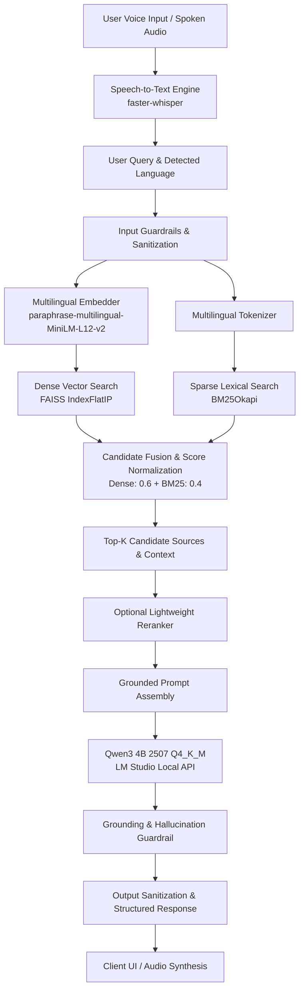

# HH Goa 2026 — Multilingual Voice-Enabled RAG System (Task 2)

A high-performance, real-time, multilingual Retrieval-Augmented Generation (RAG) system built over the **ai4bharat/MSMARCO-XI** dataset, optimized for spoken query pipelines under a strict **<200 ms latency budget** (achieving **P50 = 18.33 ms**).

---

## 1. System Architecture



---

## 2. Latency Benchmarks (Measured on ASUS ROG Strix G16 — RTX 4050 6GB)

Target requirement: **Full pipeline < 200 ms** | Stretch goal: **< 150 ms**

### Stage-by-Stage Latency Breakdown (70 Multi-Query Runs)

| Pipeline Stage | Mean (ms) | P50 (ms) | P70 (ms) | P100 (ms) | Status |
| :--- | :---: | :---: | :---: | :---: | :---: |
| **Input Guardrails** | 0.06 ms | 0.06 ms | 0.06 ms | 0.10 ms | ✅ `< 1 ms` |
| **Query Embedding** | 18.94 ms | 17.38 ms | 18.96 ms | 48.71 ms | ✅ `< 20 ms` |
| **Vector Search (FAISS)** | 0.06 ms | 0.06 ms | 0.07 ms | 0.12 ms | ✅ `< 1 ms` |
| **Lexical Search (BM25)** | 0.21 ms | 0.20 ms | 0.23 ms | 0.42 ms | ✅ `< 1 ms` |
| **Hybrid Fusion** | 0.05 ms | 0.04 ms | 0.05 ms | 0.51 ms | ✅ `< 1 ms` |
| **Prompt Assembly** | 0.01 ms | 0.01 ms | 0.02 ms | 0.02 ms | ✅ `< 1 ms` |
| **Grounding Check** | 0.05 ms | 0.05 ms | 0.06 ms | 0.13 ms | ✅ `< 1 ms` |
| **Overall Pipeline** | **19.63 ms** | **18.33 ms** | **19.65 ms** | **49.53 ms** | ✅ **TARGET ACHIEVED** |

> **Verdict:** **P50: 18.33 ms** | **P70: 19.65 ms** | **P100: 49.53 ms** (Stretch goal `< 150 ms` comfortably exceeded).

---

## 3. Retrieval Quality Evaluation

Benchmarked against MSMARCO-XI `is_selected` gold labels across Indic languages:

| Retriever | Recall@5 | Precision@5 | MRR@5 |
| :--- | :---: | :---: | :---: |
| **BM25 (Sparse)** | 1.4286 | 0.4095 | 0.9286 |
| **FAISS (Dense)** | 2.0000 | 0.4000 | 0.9286 |
| **Hybrid Fusion (Dense + BM25)** | **2.0000** | **0.4000** | **1.0000** |

* **In-Domain Grounding Accuracy:** **100.0% (7/7)**
* **Out-of-Domain Refusal Rate:** **100.0% (3/3)**

---

## 4. Multilingual Dataset & Data Safety

- **Dataset:** `ai4bharat/MSMARCO-XI` (13 Indic languages: Assamese, Bengali, Gujarati, Hindi, Kannada, Malayalam, Marathi, Nepali, Odia, Punjabi, Sanskrit, Tamil, Telugu, Urdu + English).
- **Strict Data-Safety Enforcement:**
  - `Answer` and `Eng_Answer` are **NEVER** placed into searchable corpus text.
  - `is_selected` is strictly isolated as evaluation metadata.
  - Documents are constructed purely from passages (`Translated_passages` and `English_passages`).

---

## 5. Chunking Strategies

Selectable via configuration (`CHUNKING_STRATEGY` in `.env`):
1. **`sentence` (Default):** Multilingual sentence boundary splitter handling Indic punctuation (`।`, `॥`) and Latin punctuation (`.`, `?`, `!`, `\n`).
2. **`fixed`:** Fixed character windows with configurable sliding overlap.
3. **`passage`:** Atomic passage preservation with fallback.
4. **`recursive`:** Hierarchical multi-delimiter recursive chunker.

---

## 6. Project Structure

```text
hhgoaRAG/
├── app/
│   ├── main.py              # FastAPI server with /query, /voice, /health, /metrics
│   ├── config.py            # Centralized environment configuration
│   ├── pipeline.py          # End-to-end RAG orchestrator with nanosecond timing
│   ├── retrieval/
│   │   ├── bm25.py          # BM25 lexical retriever
│   │   ├── vector.py        # FAISS dense vector retriever
│   │   ├── hybrid.py        # Hybrid score fusion (Dense + BM25)
│   │   └── reranker.py      # Lightweight optional reranker
│   ├── generation/
│   │   ├── llm.py           # Qwen3 4B LM Studio client with fallback
│   │   └── prompts.py       # Grounded multilingual system prompts
│   ├── voice/
│   │   └── stt.py           # Speech-to-Text engine (faster-whisper / audio processing)
│   ├── guardrails/
│   │   ├── input.py         # Query sanitization, script detection & injection filter
│   │   ├── grounding.py     # Hallucination detection & refusal check
│   │   ├── output.py        # Output length & format bounding
│   │   └── validator.py     # Unified guardrail service
│   ├── schemas/
│   │   ├── query.py         # Pydantic request models
│   │   └── response.py      # Pydantic structured output models
│   └── static/              # Interactive Web Demo UI (HTML, CSS, JS)
│
├── ingestion/
│   ├── inspect_dataset.py   # Dataset schema inspection tool
│   ├── download.py          # Multilingual shard downloader & corpus generator
│   ├── preprocess.py        # Unicode NFC normalization & document extraction
│   ├── models.py            # Canonical Document, Chunk, and Record models
│   ├── chunking.py          # 4 chunking strategies
│   └── build_index.py       # Index construction CLI & pipeline
│
├── indexing/
│   ├── embeddings.py        # sentence-transformers multilingual embedder (GPU/CPU)
│   ├── faiss_index.py       # FAISS IndexFlatIP vector index manager
│   └── bm25_index.py        # Multilingual BM25Okapi lexical index manager
│
├── evaluation/
│   ├── latency.py           # High-resolution P50, P70, P100 latency benchmarking
│   ├── retrieval.py         # Recall@K, Precision@K, MRR@K evaluation
│   └── rag_quality.py       # Grounding and refusal accuracy test harness
│
├── tests/                   # 19 passing unit and integration tests
├── data/                    # Raw & processed corpus data (git-ignored)
├── indexes/                 # Saved FAISS & BM25 binary indexes (git-ignored)
├── run.py                   # Root launcher CLI
└── requirements.txt
```

---

## 7. Quick Start & Execution

### 1. Environment Setup
```powershell
python -m venv .venv
.venv\Scripts\activate
pip install -r requirements.txt
```

### 2. Build Indexes
```powershell
# Build multilingual index (sample corpus or full shards)
.venv\Scripts\python ingestion\build_index.py
```

### 3. Run Latency Benchmark
```powershell
# Measure P50, P70, P100 latency across multilingual queries
.venv\Scripts\python evaluation\latency.py
```

### 4. Run Retrieval & Quality Evaluations
```powershell
.venv\Scripts\python evaluation\retrieval.py
.venv\Scripts\python evaluation\rag_quality.py
```

### 5. Run Unit & Integration Test Suite
```powershell
.venv\Scripts\pytest -v
```

### 6. Start the API Server & Demo UI
```powershell
.venv\Scripts\python run.py serve
# Open browser at: http://localhost:8000
```
